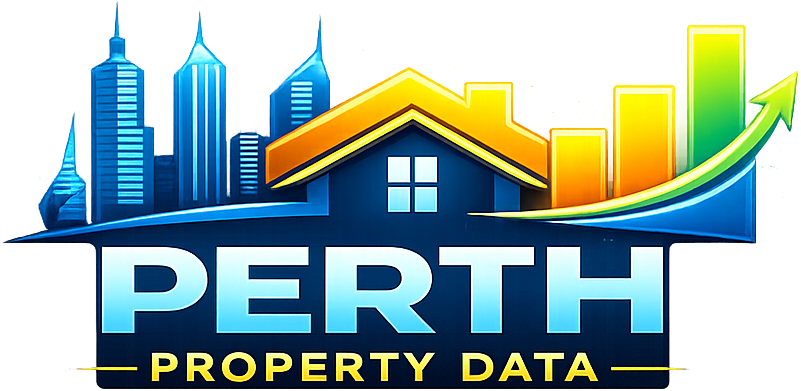

<p align="center">
  <a href="https://jfilhorv.github.io/perth_property_data/dashboard/">
    
  </a>
</p>

<p align="center">
  
</p>

<h2 align="center">Perth Property Data</h2>

<p align="center">
  <strong>Perth sold-property analytics</strong> — a small Python data pipeline plus a static, interactive dashboard (no framework build step).
</p>

---

## Overview

This repository turns a **CSV of sold listings** into **JSON** consumed by a **single-page dashboard**. You can explore prices over time, compare suburbs, inspect individual properties, and view listings on a map — including optional layers for schools and public transport when the supporting data is present.

---

## What is in the dashboard?

| Area | What you get |
|------|----------------|
| **Header** | Branded banner, logo, and title; **Montserrat** for the main heading. |
| **KPI strip** | High-level stats driven by the current filter set (counts, median / mean / spread where applicable). |
| **Filters** | Suburb, bedrooms, bathrooms, **year**, and a **dual-handle price range**. **Clear filters** gains a soft highlight whenever any filter is active. |
| **Yearly median price** | Line or bar chart (toggle). Interactions can focus the chart on a suburb or a specific property’s sale history when the data allows. |
| **Map** | **Leaflet** map with suburb heat polygons, individual properties, optional parks, estimated school points, and (if generated) simplified **PTA** public transport overlays. |
| **Suburbs table** | Sortable **Suburbs by sales volume** (and related price / variation columns). |
| **Properties table** | Parallel view: **Properties by sales volume** at **address** level, same style of metrics, with **pagination** (20 rows per page) and its own sort state. |
| **Distribution** | Suburb-level price distribution visualisation (Chart.js), aligned with the rest of the filtering model. |

The UI is plain **HTML**, **CSS**, and **vanilla JavaScript** (`dashboard/app.js`), with **Chart.js**, **Plotly**, and **Leaflet** loaded from CDNs.

---

## Repository layout

| Path | Role |
|------|------|
| `perth_property_data.csv` | **Input** sold-property dataset (place at repo root before running the pipeline; it may be gitignored or absent in clones). |
| `scripts/build_dashboard_data.py` | Reads the CSV with **pandas**, aggregates, and writes JSON under `dashboard/data/`. |
| `scripts/build_public_transport_data.py` | Optional: builds trimmed GeoJSON for the dashboard when PTA source files exist. |
| `scripts/fetch_parks_osm.py` | Optional helper: downloads metro-wide parks/green areas from OpenStreetMap (Overpass API) to refresh parks layer inputs. |
| `scripts/property_annual_returns.py` | Builds `property_annual_return_*.json` (sale-to-sale CAGR and per-property summaries) from the CSV. |
| `scripts/run_update.py` | **Entry point**: runs the dashboard build; if PTA stop/route GeoJSON folders are present, runs the public-transport build as well. |
| `dashboard/` | Static front end: `index.html`, `styles.css`, `app.js`, `assets/` (logo, banner, favicon). |
| `dashboard/data/` | **Generated** JSON (and GeoJSON) consumed by the app — refresh via the scripts above. |
| `data_schema.md` | Notes on columns, types, and data quality where documented. |

---

## Documentation

| Location | Contents |
|----------|----------|
| **`README.md`** (this file) | Project purpose, dashboard features, data inventory, and how to run / refresh data. |
| **`data_schema.md`** | Schema notes for the listing dataset. May reference screenshots or diagrams under **`image/data_schema/`**. |
| **`scripts/build_dashboard_data.py`** | Inline comments; defines which CSV columns are exported into `listings_core` / `listings_sample` and how aggregates are built. |
| **`scripts/property_annual_returns.py`** | Docstring: sale dedupe rules, CAGR formula, and projection helpers. |
| **`scripts/build_public_transport_data.py`** | Module docstring: PTA source paths, Perth metro bounding box, and output file names. |
| **`scripts/run_update.py`** | Short entrypoint: order of builds and when public-transport generation runs. |
| **PTA GeoJSON folders** (if present) | Some downloads include **`metadata.txt`** beside the `.geojson` (supplier metadata). |

---

## Data: inputs (source files)

| Path | Role |
|------|------|
| **`perth_property_data.csv`** | **Primary input.** Sold listings (one row per sale / listing as defined in your extract). Required at the **repository root**. The pipeline **drops** rows with missing, non-numeric, or **&lt; AUD 100,000** `Price` (`MIN_PRICE_AUD` in `scripts/build_dashboard_data.py`). **Regenerate** all `dashboard/data/*.json` after changing the CSV or this rule (`python scripts/run_update.py`). |
| **`Stops_PTA_001_WA_GDA2020_Public_GeoJSON/Stops_PTA_001_WA_GDA2020_Public.geojson`** | **Optional.** WA public transport stops (GDA2020). Used only if this folder and file exist when you run `run_update.py`. |
| **`Service_Routes_PTA_002_WA_GDA2020_Public_GeoJSON/Service_Routes_PTA_002_WA_GDA2020_Public.geojson`** | **Optional.** WA service route geometry. Same condition as stops. |
| **`dashboard/data/suburb_boundaries.geojson`** | **Required for suburb polygon rendering.** WA locality boundaries filtered to dashboard suburbs (generated from Geoscape WA Localities). |
| **`dashboard/data/parks.geojson`** | **Optional.** Metro-wide parks/green-area polygons for map overlay. Current project build uses OpenStreetMap extraction via Overpass. |

**School locations on the map** are **not** a separate download: `school_points_estimated.json` is **derived in the pipeline** from listing fields (e.g. primary school name and coordinates aggregated from sales rows).

Other archives or layers you may keep in the repo (for example regional parks ZIPs or rail-corridor GeoJSON) are **not** read by the current dashboard scripts unless you extend the pipeline.

### External source links currently used

- **WA Suburb/Locality Boundaries (Geoscape, CC BY 4.0):** [data.gov.au dataset page](https://data.gov.au/data/dataset/wa-suburb-locality-boundaries-geoscape-administrative-boundaries)
- **GeoJSON/WFS endpoint listed by data.gov.au:** [resource page](https://data.gov.au/data/dataset/wa-suburb-locality-boundaries-geoscape-administrative-boundaries/resource/41ecb706-30cf-406d-8314-6ed6baec696b)
- **OpenStreetMap (parks / green areas) via Overpass API:** [Overpass API](https://overpass-api.de/api/interpreter), [OSM Overpass docs](https://wiki.openstreetmap.org/wiki/Overpass_API)

---

## Data: generated outputs (`dashboard/data/`)

Created by **`scripts/build_dashboard_data.py`** unless noted otherwise. Every file below reflects the **price-filtered** dataset (numeric **Price ≥ AUD 100,000** only).

| File | Description |
|------|-------------|
| **`summary.json`** | Dataset-wide rollups: row count, column count, sale date range, price median / mean / P75 / P95. |
| **`listings_core.json`** | Per-row listing attributes (geocoded rows only), including price, dates, suburb, address, beds/baths, land size, distances, school name fields — used as the main fact table in the browser. |
| **`listings_sample.json`** | Random subset of listings (up to 8,000 rows) with the same column slice; useful for lighter experiments (not loaded by the current `app.js`). |
| **`yearly.json`** | Median price and sale counts by **calendar year** (aggregate). |
| **`yearly_by_suburb.json`** | Median price and counts by **suburb × year**. |
| **`property_type_stats.json`** | Counts and median price by **property type**. |
| **`suburb_stats.json`** | Suburb-level counts, median / average price, average distance to CBD. |
| **`suburb_map_stats.json`** | Suburb centroids (mean lat/lon), counts, and average / median price for **map** circles. |
| **`school_points_estimated.json`** | One point per primary school name with estimated coordinates (mean of listing locations) and counts — used by the dashboard map layer. |
| **`suburb_boundaries.geojson`** | Suburb/locality polygons used by the map choropleth/heat rendering for suburb-based metrics. |
| **`parks.geojson`** | Parks/green-area polygons shown in the optional `Parks` map layer. |

Created by **`scripts/property_annual_returns.py`** (invoked from `build_dashboard_data.py`):

| File | Description |
|------|-------------|
| **`property_annual_return_intervals.json`** | One row per **consecutive sale pair** on the same `house_key` (aligned with dashboard `houseKey` logic). Fields: `prev_date_sold`, `date_sold`, `prev_price`, `price`, `years` (elapsed time in **fractional years**, days ÷ 365.25), `annual_return`. Pairs with **`years` &lt; 1** are omitted (unstable CAGR on short holds). Intervals with **CAGR &gt; 100%/yr** are omitted. |
| **`property_annual_return_summary.json`** | One row per property with **latest** sale price/date, `interval_count`, and **`avg_annual_return`** (mean of interval CAGR values). Includes **`future_price_1y`** = `current_price * (1 + avg_annual_return)` when the average is defined. |

**Deduplication before intervals:** same calendar day + same price → one row; same day + different prices → **keep max price** only. **Annualized return** between sales: `(price / prev_price) ** (1 / years) - 1`, only when elapsed time is **at least one year**. For horizons of *n* years: `future_price = current_price * (1 + avg_annual_return) ** n` (not stored for every *n* in JSON; compute in the UI or extend the pipeline).

Created by **`scripts/build_public_transport_data.py`** when PTA inputs exist:

| File | Description |
|------|-------------|
| **`public_transport_stops.geojson`** | Stops clipped / simplified for Greater Perth for browser use. |
| **`public_transport_routes.geojson`** | Route linework clipped / simplified for the same area. |
| **`parks_osm_raw.json`** | Raw Overpass response used to produce `parks.geojson` (if you choose to refresh parks data via script). |

---

## Data: what the dashboard loads in the browser

At startup, **`dashboard/app.js`** fetches:

| File | Purpose |
|------|---------|
| **`summary.json`** | Baseline KPI metadata combined with live-filtered rows. |
| **`listings_core.json`** | All charts, tables, map markers, and filters. |
| **`property_annual_return_intervals.json`** | Optional precomputed resale intervals; if present and non-empty, the dashboard uses the same suburb metric as in-browser logic. **Suburb “Avg resale growth (%)”** = **mean** across calendar years of the **per-year mean CAGR** (each interval: later sale year, same `house_key`, hold **≥ 1 year**, CAGR **≤ 100%/yr**, same-day dedupe; not a sum of simple price deltas). |
| **`school_points_estimated.json`** | School overlay on the map. |
| **`public_transport_stops.geojson`** | Optional; if missing or invalid, transport layers are skipped gracefully. |
| **`public_transport_routes.geojson`** | Optional; same as above. |
| **`suburb_boundaries.geojson`** | Suburb polygon boundaries for heat/choropleth map rendering. |
| **`parks.geojson`** | Optional parks/green-area overlay layer. |

The other JSON files in `dashboard/data/` are **still produced** by the pipeline for analysis, exports, or future UI — they are **not** requested by the current static page.

---

## Requirements

- **Python 3.10+** (or compatible) with **pandas** installed (`pip install pandas` if needed).
- A modern browser for the dashboard.

---

## Regenerate dashboard data

From the repository root:

```bash
python scripts/run_update.py
```

This expects `perth_property_data.csv` at the project root. Rows with **missing `Price`**, **price &lt; AUD 100,000**, or **non‑numeric price** are **dropped** before any aggregates are built. **Re-run this command after changing the CSV or the price rule** so every JSON under `dashboard/data/` stays in sync (KPIs, map, tables, CAGR). It refreshes `summary.json`, `listings_core.json`, `yearly.json`, `property_annual_return_intervals.json`, `property_annual_return_summary.json`, and related files. If the script exits with an error, **no row** satisfied the price filter — check the data or `MIN_PRICE_AUD` in `scripts/build_dashboard_data.py`.

Without the CSV, you can still drop `Price` &lt; 100k from an existing `dashboard/data/listings_core.json` and refresh `summary.json` counts with:

```bash
node scripts/sanitize_dashboard_data_min_price.js
```

If you have the PTA GeoJSON datasets in the expected folders (`Stops_PTA_001_…`, `Service_Routes_PTA_002_…`), the same command also rebuilds the simplified transport layers used by the map.

To refresh parks data from OpenStreetMap (metro Perth extract), run:

```bash
python scripts/fetch_parks_osm.py
```

This creates/updates `dashboard/data/parks_osm_raw.json` and is used to regenerate `dashboard/data/parks.geojson` in this project workflow.

---

## Assets (branding)

Bundled under `dashboard/assets/`:

- **`perth-property-logo.png`** — header wordmark.
- **`header-banner.png`** — full-width header background.
- **`favicon.png`** — browser tab / bookmark icon (`rel="icon"` and `apple-touch-icon` in `index.html`).

---

## Licence and data

Listing data and third-party spatial extracts (PTA, parks, etc.) may be subject to **their own terms**. Use this project in line with those sources and applicable law.

---

<p align="center">
  <a href="https://jfilhorv.github.io/perth_property_data/dashboard/">
    
  </a>
</p>

<p align="center">
  <sub>Built for clear, filter-driven exploration of Perth property sales.</sub>
</p>
