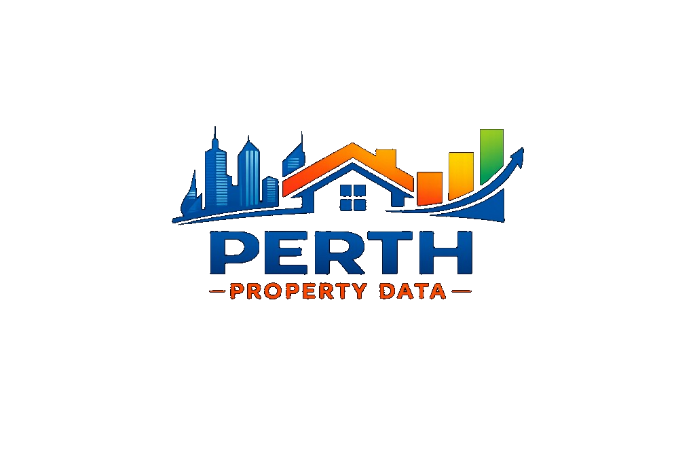

<p align="center">
  
</p>

<p align="center">
  
</p>

<h2 align="center">Perth Property Data</h2>

<p align="center">
  <strong>Perth sold-property analytics</strong> — a small Python data pipeline plus a static, interactive dashboard (no framework build step).
</p>

---

## Overview

This repository turns a **CSV of sold listings** into **JSON** consumed by a **single-page dashboard**. You can explore prices over time, compare suburbs, inspect individual properties, and view listings on a map — including optional layers for schools and public transport when the supporting data is present.

---

## What is in the dashboard?

| Area | What you get |
|------|----------------|
| **Header** | Branded banner, logo, and title; **Montserrat** for the main heading. |
| **KPI strip** | High-level stats driven by the current filter set (counts, median / mean / spread where applicable). |
| **Filters** | Suburb, bedrooms, bathrooms, **year**, and a **dual-handle price range**. **Clear filters** gains a soft highlight whenever any filter is active. |
| **Yearly median price** | Line or bar chart (toggle). Interactions can focus the chart on a suburb or a specific property’s sale history when the data allows. |
| **Map** | **Leaflet** map with toggles for suburb aggregates, individual properties, estimated school points, and (if generated) simplified **PTA** public transport overlays. |
| **Suburbs table** | Sortable **Suburbs by sales volume** (and related price / variation columns). |
| **Properties table** | Parallel view: **Properties by sales volume** at **address** level, same style of metrics, with **pagination** (100 rows per page) and its own sort state. |
| **Distribution** | Suburb-level price distribution visualisation (Chart.js), aligned with the rest of the filtering model. |

The UI is plain **HTML**, **CSS**, and **vanilla JavaScript** (`dashboard/app.js`), with **Chart.js**, **Plotly**, and **Leaflet** loaded from CDNs.

---

## Repository layout

| Path | Role |
|------|------|
| `perth_property_data.csv` | **Input** sold-property dataset (place at repo root before running the pipeline; it may be gitignored or absent in clones). |
| `scripts/build_dashboard_data.py` | Reads the CSV with **pandas**, aggregates, and writes JSON under `dashboard/data/`. |
| `scripts/build_public_transport_data.py` | Optional: builds trimmed GeoJSON for the dashboard when PTA source files exist. |
| `scripts/run_update.py` | **Entry point**: runs the dashboard build; if PTA stop/route GeoJSON folders are present, runs the public-transport build as well. |
| `dashboard/` | Static front end: `index.html`, `styles.css`, `app.js`, `assets/` (logo, banner, favicon). |
| `dashboard/data/` | **Generated** JSON (and GeoJSON) consumed by the app — refresh via the scripts above. |
| `data_schema.md` | Notes on columns, types, and data quality where documented. |

---

## Requirements

- **Python 3.10+** (or compatible) with **pandas** installed (`pip install pandas` if needed).
- A modern browser for the dashboard.
- For local preview, any static file server (see below). Opening `index.html` via `file://` often breaks `fetch()` for JSON — use **http://** instead.

---

## Regenerate dashboard data

From the repository root:

```bash
python scripts/run_update.py
```

This expects `perth_property_data.csv` at the project root. It refreshes files such as `summary.json`, `listings_core.json`, `yearly.json`, and related aggregates under `dashboard/data/`.

If you have the PTA GeoJSON datasets in the expected folders (`Stops_PTA_001_…`, `Service_Routes_PTA_002_…`), the same command also rebuilds the simplified transport layers used by the map.

---

## Run the dashboard locally

```bash
python -m http.server 8000
```

Then open:

**http://localhost:8000/dashboard/**

---

## Assets (branding)

Bundled under `dashboard/assets/`:

- **`perth-property-logo.png`** — header wordmark.
- **`header-banner.png`** — full-width header background.
- **`favicon.png`** — browser tab / bookmark icon (`rel="icon"` and `apple-touch-icon` in `index.html`).

---

## Licence and data

Listing data and third-party spatial extracts (PTA, parks, etc.) may be subject to **their own terms**. Use this project in line with those sources and applicable law.

---

<p align="center">
  <sub>Built for clear, filter-driven exploration of Perth property sales.</sub>
</p>
